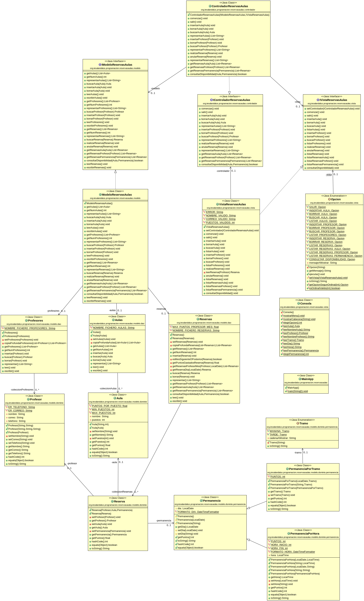

# Tarea Reservas de Aulas
## Profesor: José Ramón Jiménez Reyes
## Alumno:

Desde el IES Al-Ándalus nos acaban de comentar que por favor añadamos persistencia a los datos introducidos, ya que tal y como está ahora la aplicación no es funcional. Por tanto, en esta tarea añadiremos persistencia a los datos utilizando para ello ficheros de objetos.

El diagrama de clases queda como te muestro a continuación y poco a poco te iré explicando los diferentes pasos a realizar:

He subido a GitHub un esqueleto de proyecto gradle que ya lleva incluidos todos los test necesarios que el programa debe pasar. Dichos test están todos comentados y deberás ir descomentándolos conforme vayas avanzando con la tarea. La URL del repositorio es en la que te encuentras.

Por tanto, tu tarea va a consistir en completar los siguientes apartados:

1. Lo primero que debes hacer es realizar un fork del repositorio donde he colocado el proyecto gradle con la estructura del proyecto y todos los test necesarios.
2. Clona tu repositorio remoto recién copiado en github a un repositorio local que será donde irás realizando lo que a continuación se te pide. Añade tu nombre al fichero `README.md` en el apartado "Alumno". Realiza tu primer commit.
3. Haz que las clases de dominio (para las que sea necesario) sean serializables para que se puedan leer y escribir de ficheros de objetos. Realiza un commit.
4. Implementa los métodos de lectura y escritura para la clase dao `Aulas`. Realiza un commit.
5. Implementa los métodos de lectura y escritura para la clase dao `Profesores`. Realiza un commit.
6. Implementa los métodos de lectura y escritura para la clase dao `Reservas`. Realiza un commit.
7. Has que estos métodos sean accesibles desde el controlador, por lo que deberás modificar la clase `ModeloReservasAulas` y la interfaz `IModeloReservasAulas`. Realiza un commit.
8. Haz las modificaciones oportunas en el controlador para que al comenzar se leen los diferentes ficheros y al salir se escriban los mismos. Realiza un commit y súbelo a tu repositorio remoto.

###### Se valorará:
- La nomenclatura del repositorio de GitHub y del archivo entregado sigue las indicaciones de entrega.
- La indentación debe ser correcta en cada uno de los apartados.
- El nombre de las variables debe ser adecuado.
- Se debe utilizar la clase `Entrada` para realizar la entrada por teclado.
- El proyecto debe pasar todas las pruebas que van en el esqueleto del mismo y toda entrada del programa será validada para evitar que el programa termine abruptamente debido a una excepción.
- Se deben utilizar los comentarios adecuados.
- Se valorará la corrección ortográfica tanto en los comentarios como en los mensajes que se muestren al usuario.

